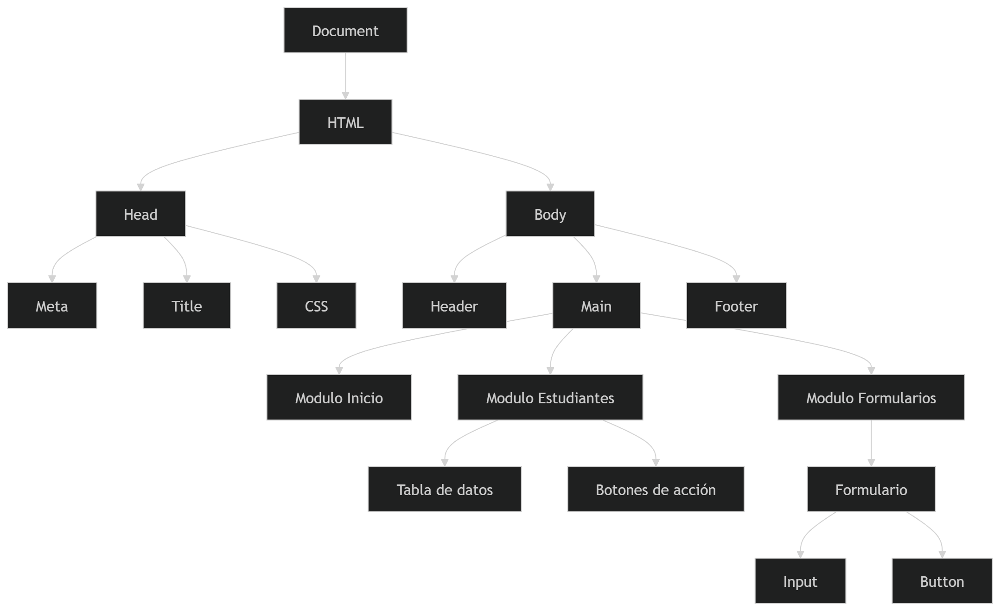
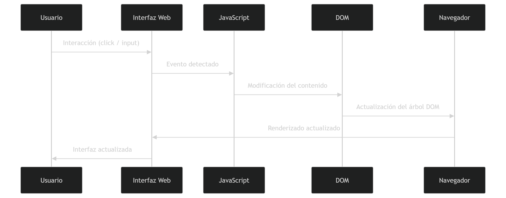

# SISTEMA DE GESTIÓN ACADÉMICA 
==============================

Este proyecto nace como una solución ante la problemática de la deserción universitaria.
Muchos estudiantes abandonan sus estudios debido a la falta de organización y la desmotivación al no poder visualizar su progreso académico de forma clara.

La plataforma web propuesta actúa como un acompañante estratégico para el estudiante, permitiéndole gestionar sus actividades académicas, monitorear su rendimiento y recibir alertas tempranas que le permitan tomar decisiones oportunas para mejorar su desempeño.

========================
## Objetivo de proyecto
========================
Proporcionar una herramienta tecnológica eficaz que permita a los estudiantes:

1.Organizar sus tareas académicas.
2.Gestionar sus tiempos de estudio.
3.Monitorear su progreso académico.
4.Mantener la motivación mediante el cumplimiento de metas.
5.Recibir alertas tempranas basadas en métricas de rendimiento académico.

De esta manera se busca reducir la deserción estudiantil mediante el apoyo de herramientas digitales que faciliten la organización y seguimiento del proceso de aprendizaje.

========================
### Etapa 1: Analisis
========================

En esta etapa se realizó la identificación del problema, los actores involucrados y el contexto en el cual opera el sistema.

Se definieron los siguientes aspectos:

1.Problema a resolver
2.Usuarios del sistema
3.Alcance del proyecto
4.Flujo de entrada, procesamiento y salida de la información
5.Contexto académico en el cual será utilizado el sistema

Esta fase permitió comprender las necesidades del usuario y establecer las bases para el desarrollo del sistema.
========================
### Etapa 2: Requisitos
========================
Durante esta etapa se identificaron y documentaron los requerimientos funcionales y no funcionales del sistema.

Entre las actividades realizadas se incluyen:

1.Definición de requerimientos funcionales
2.Definición de requerimientos no funcionales
3.Elaboración de diagramas de clases
4.Elaboración de diagramas de flujo
5.Identificación de actores del sistema
6.Justificación de la arquitectura tecnológica utilizada

Esta fase permitió establecer la estructura lógica y técnica que guiará el desarrollo de la aplicación.

====================================================
Etapa 3: Manipulacion del Dom y puntos criticos 
===================================================

En esta etapa se documenta el uso del Document Object Model (DOM) dentro del sistema y su relación con la interacción del usuario en la interfaz web.

El DOM permite representar el documento HTML como una estructura jerárquica de nodos en memoria, lo que posibilita que el sistema modifique dinámicamente los elementos de la interfaz mediante JavaScript.

Gracias a la manipulación del DOM, la aplicación puede:

1.Actualizar información en tiempo real.
2.Mostrar dinámicamente los datos del sistema.
3.Gestionar eventos generados por el usuario.
4.Modificar elementos visuales sin recargar la página.

Esto permite que la plataforma funcione como una aplicación web interactiva, mejorando la experiencia del usuario.

===================================================
Arquitectura de Manipulación del DOM en el Sistema
===================================================

El siguiente diagrama muestra cómo las interacciones del usuario generan eventos que son procesados por la lógica del sistema y finalmente actualizan el DOM.

Este flujo describe el proceso mediante el cual:

1.El usuario interactúa con la interfaz.
2.El sistema captura el evento mediante JavaScript.
3.Se ejecuta la lógica correspondiente.
4.El DOM es actualizado.
5.La interfaz se renderiza nuevamente en el navegador.

===================================================
Estructura del DOM del Sistema
===================================================

El DOM dentro del sistema se organiza como un árbol de nodos, donde cada elemento de la interfaz forma parte de una estructura jerárquica.
-------------------------------------------------------

-----------------------------------------------------
Esta estructura permite que el sistema pueda:

1.localizar elementos específicos
2.modificar contenido dinámicamente
3.agregar o eliminar elementos
4.responder a eventos del usuario
5.Ciclo de Vida de la Manipulación del DOM

El siguiente diagrama describe el flujo completo desde la interacción del usuario hasta la actualización de la interfaz en el navegador.

El proceso sigue las siguientes etapas:

1.Interacción del usuario con la interfaz.
2.Captura del evento por JavaScript.
3.Procesamiento de la lógica de la aplicación.
4.Manipulación del DOM.
5.Renderizado actualizado en el navegador.

Este mecanismo permite que la aplicación funcione de manera dinámica, interactiva y eficiente.

===================================================
Conclusión
===================================================

La manipulación del Document Object Model (DOM) es un componente esencial dentro del sistema, ya que permite gestionar la interacción entre el usuario y la interfaz de la aplicación.

Gracias al uso del DOM, la plataforma puede:

1.actualizar información en tiempo real
2.mejorar la experiencia de usuario
3.gestionar eventos de forma dinámica
4.representar visualmente los datos del sistema

Esto convierte al sistema en una aplicación web moderna, interactiva y orientada a mejorar la organización académica de los estudiantes.

